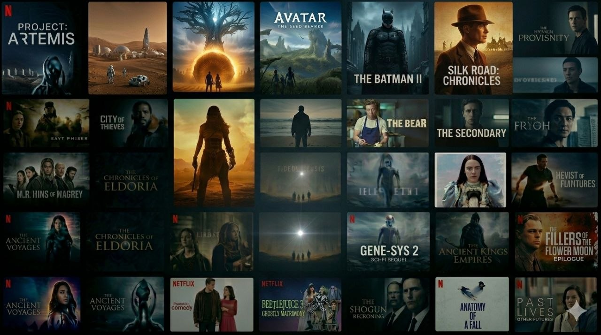
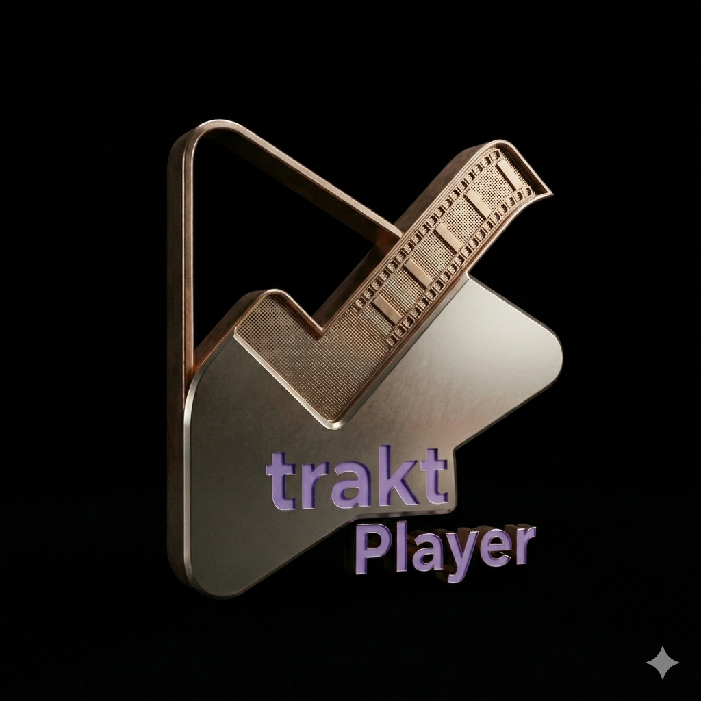
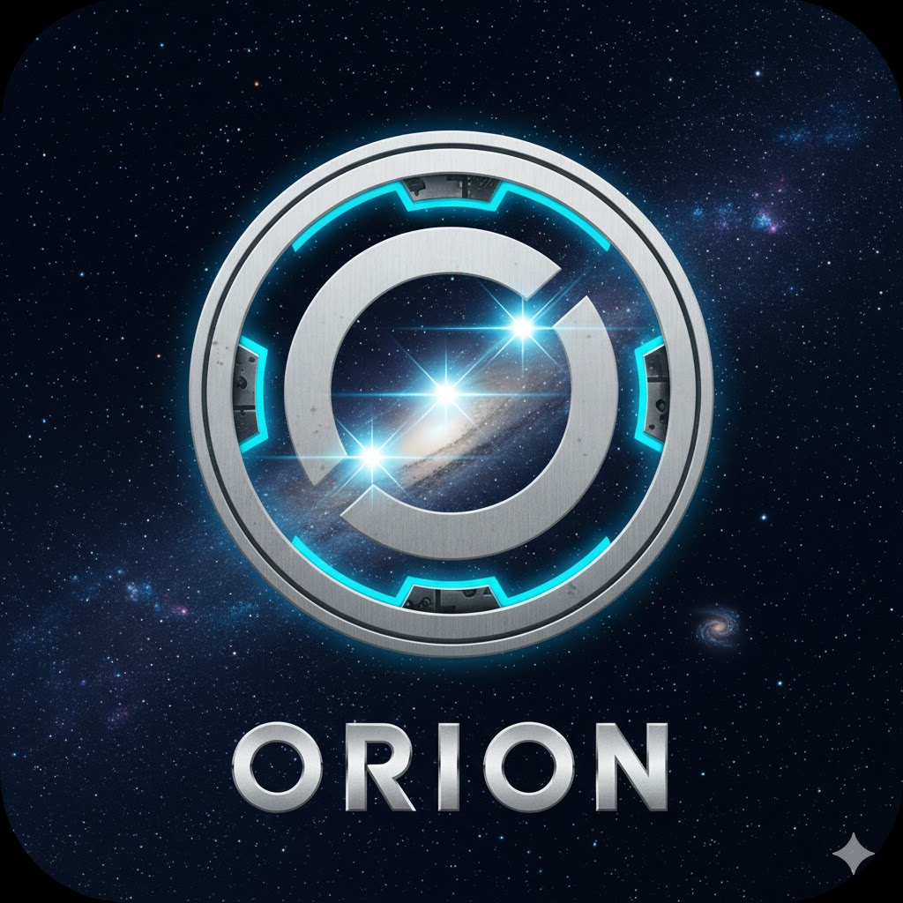
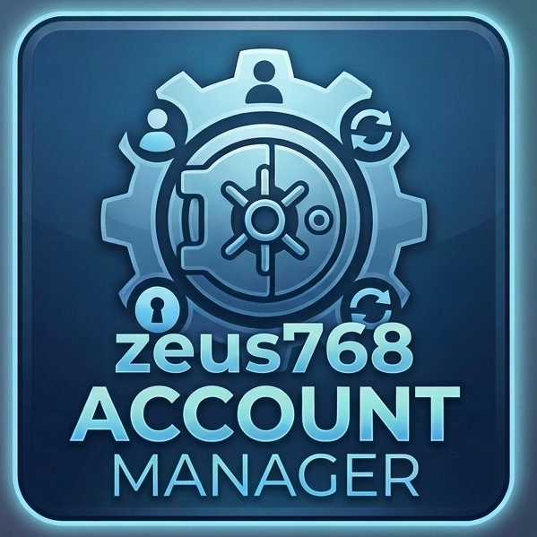

# Zeus768 Kodi Repository

The official Kodi addon repository by **zeus768** and **The Red Wizard**. All addons are built for **Kodi 21 Omega** and above (Python 3).

## How to Install

1. Download `repository.zeus768` from the `zips/` folder
2. In Kodi, go to **Settings > Add-ons > Install from zip file**
3. Select the downloaded zip
4. Go to **Install from repository > Zeus768 Repository** and install any addon below

---

## Addons

### Genesis

**Stream Movies and TV Shows** | `plugin.video.genesis` | v2026.04.04.01

Your ultimate streaming addon for Movies and TV Shows with torrent support. Features torrent scrapers for 1337x, YTS, EZTV, TPB, TorrentGalaxy and more. Includes Trakt integration, TMDB metadata, search, favourites, and custom skins.

 

---

### Genesis Themepak

**Themes for Genesis** | `script.genesis.media` | v2026.04.04

Required dependency for Genesis. Provides custom themes, artwork, and skin assets used by the Genesis video addon.

 

---

### SALTS - Stream All The Sources

**Multi-Source Video Addon** | `plugin.video.salts` | v2.4.2

The legendary SALTS addon, revived and modernized for Kodi 21+. 34+ scrapers across torrent sites, free streaming sources, anime trackers, and international sources. Features include custom source dialog with quality breakdown, Up Next auto-play, Skip Intro, 24/7 Channels (actor, show, genre, AI vibe), AI Search, Franchises, Actors, batch debrid cache checking, and Trakt integration. Supports Real-Debrid, Premiumize, AllDebrid, and TorBox. Original author: tknorris.

 

---

### Trakt Player

**Click and Play** | `plugin.video.trakt_player` | v2.1.1

Superpowered Trakt addon. Click any movie or episode and it plays instantly via Debrid. Features: Click-and-Play (auto 1080p), Trakt Scrobbling, Up Next, Continue Watching, Discovery Feed (trailer scroll with 6 modes), AI Vibe Marathons, Personalized Recommendations, My Calendar, Watch History, Friends Activity Feed, User Stats Dashboard, Custom Lists, Popular Community Lists, Cached Torrent Indicator, Rate on Trakt, and Debrid Account Status. Supports Real-Debrid, Premiumize, AllDebrid, and TorBox. 5 torrent scrapers. 100% native urllib.

 

---

### Orion

**Media Explorer** | `plugin.video.orion` | v3.2.4

Complete media addon with multiple torrent scrapers (Torrentio, MediaFusion, Jackettio, Orionoid), Real-Debrid, Premiumize, AllDebrid, TorBox support. Trakt integration with scrobbling, watchlists and liked lists. ResolveURL support, watch history, favorites, Kids Zone, and auto-play next episode.

 

---

### Strike Zone

**Watch Fight Replays** | `plugin.video.strikezone` | v1.2.2

Watch UFC, MMA, Boxing, Kickboxing, and more fight replays. Auto-scrapes all categories, infinite scroll pagination, search, local favourites, fight metadata and thumbnails, multiple video sources via ResolveURL, and custom category images.

 

---

### The Accountant

**Kodi Maintenance Suite** | `plugin.program.theaccountant` | v3.9.6

Master Pro Suite for Kodi maintenance. Speed Optimizer, Scheduled Auto-Clean, RD/PM/AD/Trakt/TMDB Auth management, IPTV Vault, Favourites Vault, USB Backup, Repair Tools, Cache and Package Cleaner.

 

---

## Support

If you enjoy these addons, consider buying zeus768 a beer:

**[Ko-fi: https://ko-fi.com/zeus768](https://ko-fi.com/zeus768)**

---

## Disclaimer

These addons do not host or distribute any content. All streams are resolved through third-party services and APIs. The authors have no affiliation with any content provider.
